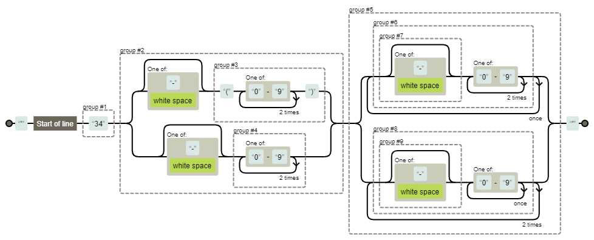

# [Phone validation | Logic & Structures - Nuwe](https://nuwe.io/dev/challenges/logic-and-structures-phone-validation)

## Sobre el desafio

Devuelve true si la cadena pasada concuerda con un número de teléfono válido en España.

El usuario puede completar el campo del formulario de la forma que elija, siempre que tenga el formato de un número español válido. Los siguientes ejemplos son de formatos válidos para números españoles (consulte las pruebas a continuación para otras variantes):

972-35-56-57

(972)355-567

972-355-567

972 355 567

972355567

34 972 355 567

Para este desafío se te presentará una cadena como 972355567 o 8oo-six427676;laskdjf. Tu trabajo es validar o rechazar el número de teléfono español basado en cualquier combinación de los formatos proporcionados arriba. El código de área es obligatorio. Si el código de país es proporcionado, debes confirmar que el código de país es 34. Devuelve true si la cadena es un número de teléfono español valido; de lo contrario devuelve false.

## Solución
Se ha implementado una función que valida un número de teléfono español a partir de expresiones regulares.
La expresión regula evalúa:
1. (opcional) El numero empieza por 34| group#1
2. El numero tiene 3 primeros digitos que pueden estar entre parentesis o no.  Puede venir seguido o precedido por un espacio, - o nada | group#2
3. Todos los digitos restantes pueden venir seguidos, en grupos de 2 o en grupos de 3. En caso de venir en grupos irían separados por un espacio o un - | group#5

```^(34)([-\s]?(\([0-9]{3}\))|[-\s]?([0-9]{3}))((([-\s]?)[0-9]{3}){2}$|(([-\s]?)[0-9]{2}){3}$)```



## Cómo probar el código
Para comprobar que funciona bien en todos los casos propuestos se ha implementado una batería de tests con Pytest

Para preparar el entorno ejecutar el siguiente comando:

```bash
conda env create -f env.yaml
conda activate nuwe-phone-validation
```

Para ejecutar los tests ejecutar el siguiente comando:

```bash
pytest -v
```
El resultado de los tests se puede ver en la captura siguiente
